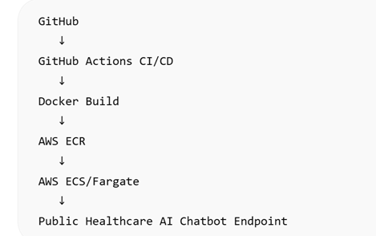
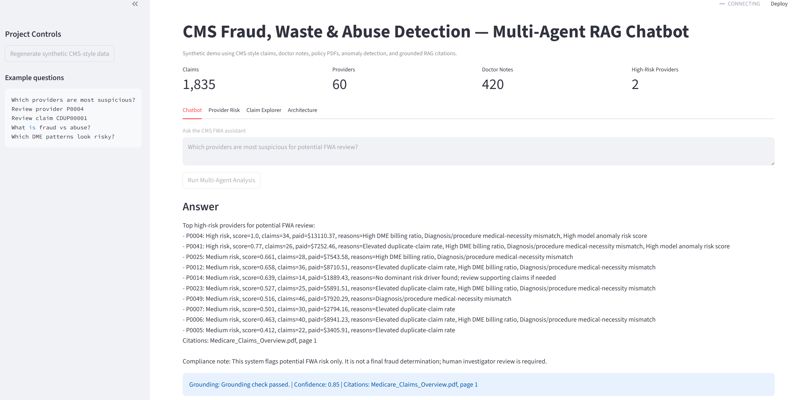
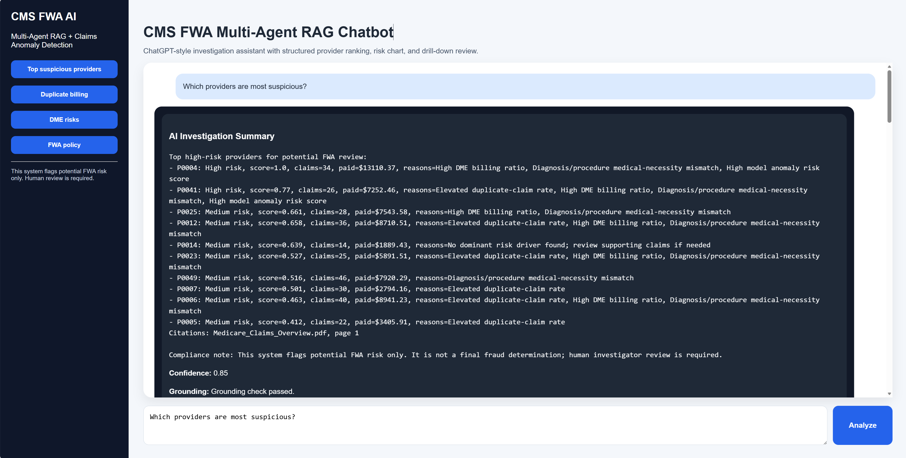
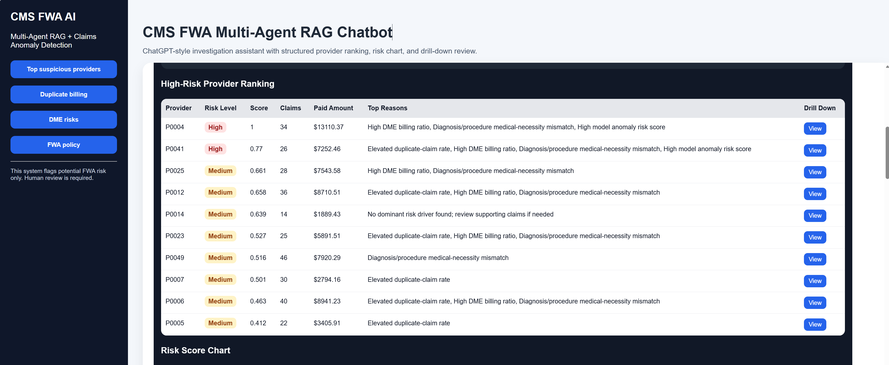
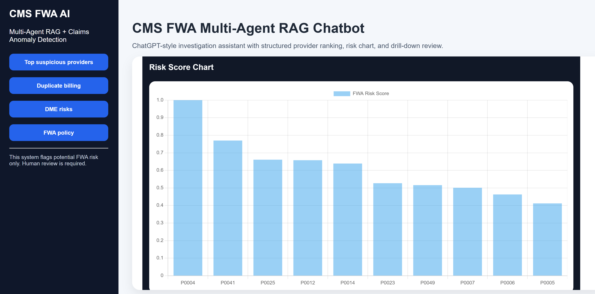
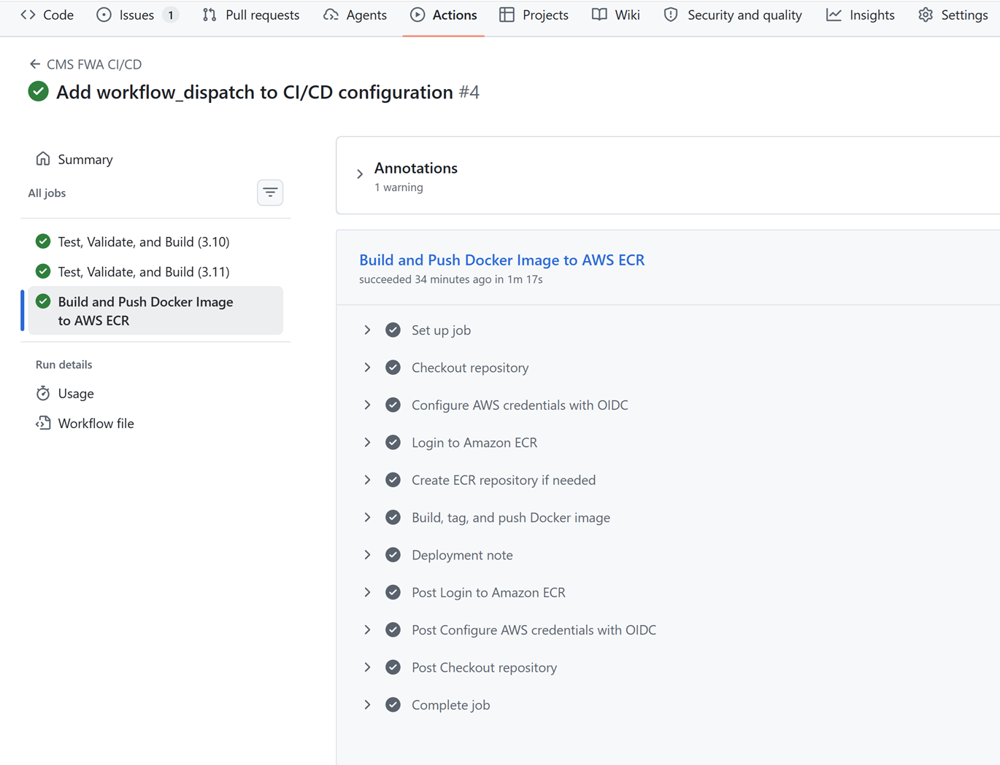
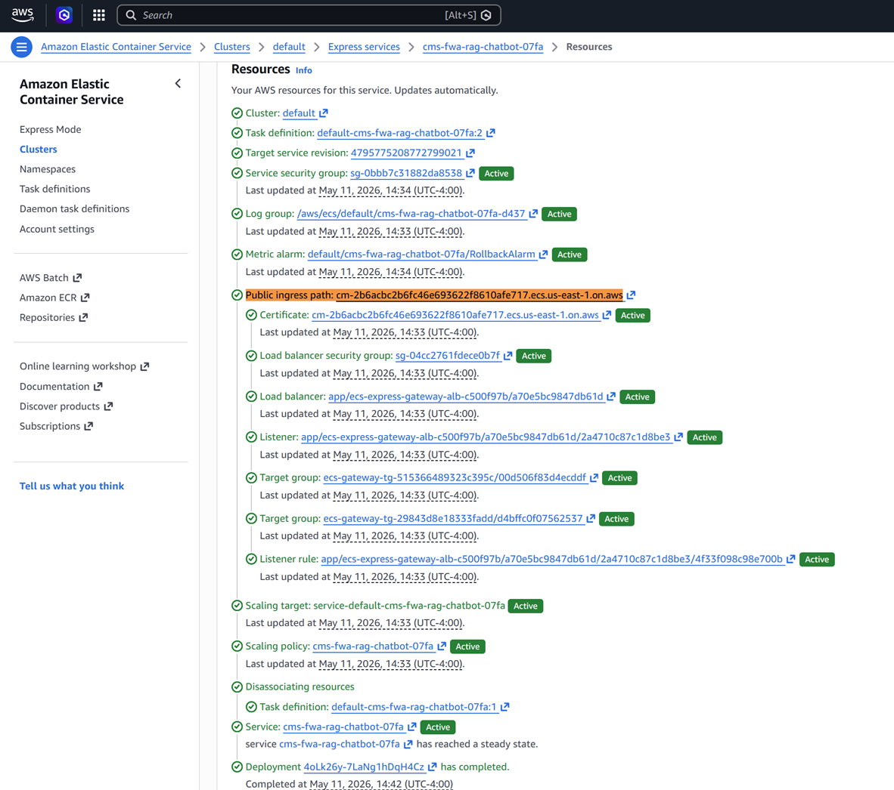

# CMS FWA Detection Multi-Agent RAG Chatbot

A comprehensive AI/ML + LLM/RAG project for detecting potential **Fraud, Waste, and Abuse (FWA)** in CMS-style Medicare and Medicaid claims data.

This project is adapted from a medical chatbot template, but redesigned for healthcare claims analytics, CMS policy retrieval, doctor-note review, anomaly detection, graph-based risk scoring, and multi-agent AI orchestration.


**Project Title:** CMS Fraud, Waste, and Abuse Detection Using Multi-Agent RAG, Claims Analytics, and Explainable AI

**Key Bullets:**

> Developed a multi-agent RAG-based AI chatbot for CMS Medicare and Medicaid FWA detection, integrating claims analytics, provider anomaly detection, doctor-note NLP, vector search, graph-based risk scoring, and explainable ML to flag suspicious billing, duplicate claims, DME risk, upcoding, and unsupported medical necessity with evidence-grounded responses and human-review guardrails.

## Advantages of this Project

- Uses CMS-style claims, provider, beneficiary, and doctor-note data.
- Includes policy PDFs in `data/cms_policy/` for RAG.
- Combines ML anomaly detection, rule-based FWA flags, graph analytics, and RAG.
- Designed to reduce hallucination through citations, structured data grounding, and guardrails.
- Produces investigator-style answers instead of unsupported LLM opinions.

## Public Data Sources to Extend This Project

- CMS Medicare Claims Synthetic Public Use Files (SynPUF): used for learning Medicare claims structures while protecting privacy.
- Synthetic Medicare enrollment, fee-for-service claims, and prescription drug event data from data.cms.gov.
- CMS and Medicaid program-integrity/FWA guidance and audit materials.
- Synthea synthetic EHR data and clinical notes for non-PHI experimentation.
- Kaggle CMS synthetic claims datasets for supervised learning practice.

## Architecture

```text
CMS / Medicaid / SynPUF / Synthea / Kaggle-style data
        ↓
Data ingestion + feature engineering
        ↓
Claims analytics + doctor-note NLP
        ↓
Policy PDF RAG index
        ↓
ML anomaly detection + rules + graph risk
        ↓
Multi-agent orchestration
        ↓
Grounded chatbot + citations + audit-style report
        ↓
CI/CD Deployment: GitHub Actions + AWS
```

## For CI/CD Pipelines (GitHub Actions)



## Streamlit UI (Interactive Dashboard)


## Multi-Agent Output (Reasoning + Prediction)


## Flask Chat UI (ChatGPT-style)


## Provider Drill-down View



## Deployment of Github Actions


## Delivery of Public End Points



## Agents

1. **Query Router Agent** — routes policy, provider-risk, and claim-review questions.
2. **Policy RAG Agent** — retrieves CMS policy PDF chunks and citations.
3. **Claims Analytics Agent** — computes duplicate claims, upcoding, DME mismatch, and provider risk.
4. **Doctor Notes NLP Agent** — checks whether notes support billed services.
5. **Graph Risk Agent** — analyzes provider-beneficiary network concentration.
6. **Explanation Agent** — creates investigator-ready summaries.
7. **Guardrail Agent** — prevents unsupported fraud accusations and enforces human-review language.

## Installation

```bash
python -m venv .venv
source .venv/bin/activate   # Windows: .venv\Scripts\activate
pip install -r requirements.txt
```

## Run Streamlit UI

```bash
python -m src.generate_sample_data
python store_index.py
streamlit run streamlit_app.py
```

## Run Flask Chatbot

```bash
python -m src.generate_sample_data
python store_index.py
python app.py
```

Open: `http://localhost:8080`

## Example Questions

```text
Which providers are most suspicious for potential FWA review?
Review provider P0004.
Review claim CDUP00001.
What is the difference between fraud, waste, and abuse?
Which DME billing patterns look risky?
Does the doctor note support this billed procedure?
```

## Anti-Hallucination Design

- Uses retrieved PDF evidence.
- Uses structured claims data instead of guessing.
- Shows citations from policy PDFs.
- Adds confidence and grounding status.
- Prevents final fraud determinations.
- Requires human investigator review.

## Important Compliance Note

This project is for education, portfolio, and prototype development. It does **not** make legal or final fraud determinations. A real production system must use approved data governance, HIPAA controls, model validation, audit logging, access control, human review, and compliance sign-off.

## Improvement

This final version includes a stronger Flask demo interface:

- ChatGPT-style conversation layout
- Quick investigation buttons
- Structured high-risk provider ranking table
- FWA risk score bar chart with Chart.js
- Provider drill-down view with claim-level evidence
- RAG citations, confidence score, and grounding status

Run the Flask demo:

```bash
python app.py
```

Open:

```text
http://127.0.0.1:8080
```

Example questions:

```text
Which providers are most suspicious?
Show duplicate billing risks
Show DME fraud risks
Explain CMS FWA policy
Drill down provider P0004
```


## CI/CD Deployment Guide: GitHub Actions + AWS

This project now includes a complete CI/CD layer for testing, Docker build, and AWS deployment preparation.

### Added files

```text
.github/workflows/ci-cd.yml
.github/workflows/ci.yml
Dockerfile
.dockerignore
scripts/check_imports.py
scripts/validate_data.py
tests/test_ci_smoke.py
deployment/aws/apprunner.yaml
deployment/aws/ecs-task-definition.json
deployment/aws/README_AWS_DEPLOYMENT.md
```

### What the CI/CD pipeline does

On push or pull request, GitHub Actions will:

1. install Python dependencies
2. generate synthetic CMS-style data
3. build the RAG/vector index
4. run import smoke tests
5. validate raw data files
6. compile Streamlit and Flask apps
7. run pytest tests
8. build a Docker image
9. push Docker image to Amazon ECR on main/master branch

### Local validation before GitHub push

```bash
python -m src.generate_sample_data
python store_index.py
python scripts/check_imports.py
python scripts/validate_data.py
pytest -q
python -m py_compile streamlit_app.py
python -m py_compile app.py
```

## AWS-CICD-Deployment-with-Github-Actions
### 1. Login to AWS console.
### 2. Create IAM user for deployment

#### Specific access:
1. EC2 access : It is virtual machine
2. ECR: Elastic Container registry to save docker image in AWS


#### Description: Docker/EC2
1. Build docker image of the source code
2. Push your docker image to ECR
3. Launch Your EC2 
4. Pull Your image from ECR in EC2
5. Lauch your docker image in EC2

#### Policies:
1. AmazonEC2ContainerRegistryFullAccess
2. AmazonEC2FullAccess

### 3. Create ECR repo to store/save docker image
Save the URI: XXX.ecr.us-east-1.amazonaws.com/XXX

### 4. Create EC2 machine (Ubuntu)

### 5. Open EC2 and Install docker in EC2 Machine:

#### Optional:

#> sudo apt-get update -y

#> sudo apt-get upgrade

#### Required:

#> curl -fsSL https://get.docker.com -o get-docker.sh

#> sudo sh get-docker.sh

#> sudo usermod -aG docker ubuntu

#> newgrp docker

### 6. Configure EC2 as self-hosted runner:
setting > actions > runner > new self hosted runner > choose os > then run command

### 7. Setup github secrets:
In GitHub repository settings, add:

```text
AWS_ROLE_TO_ASSUME
AWS_ACCOUNT_ID
OPENAI_API_KEY
```


