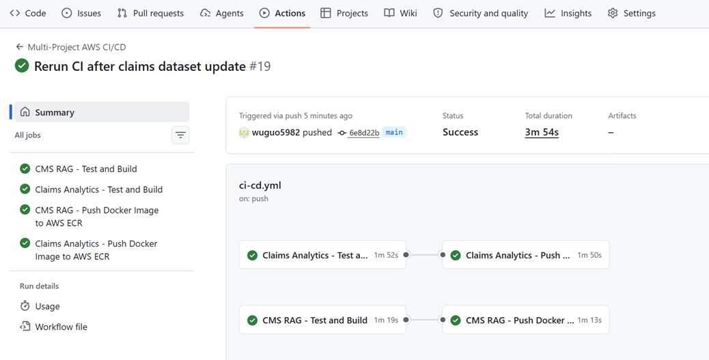
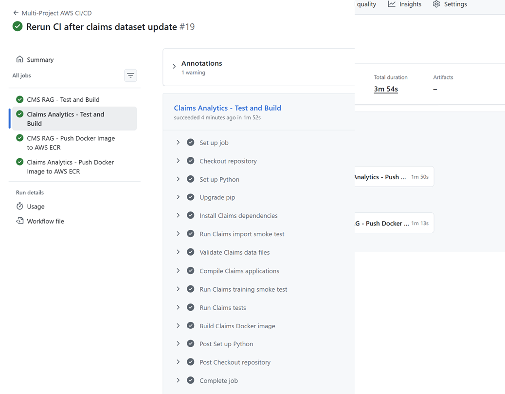
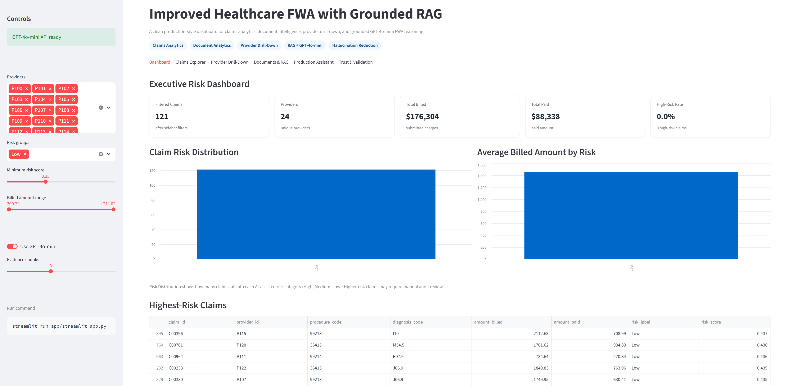
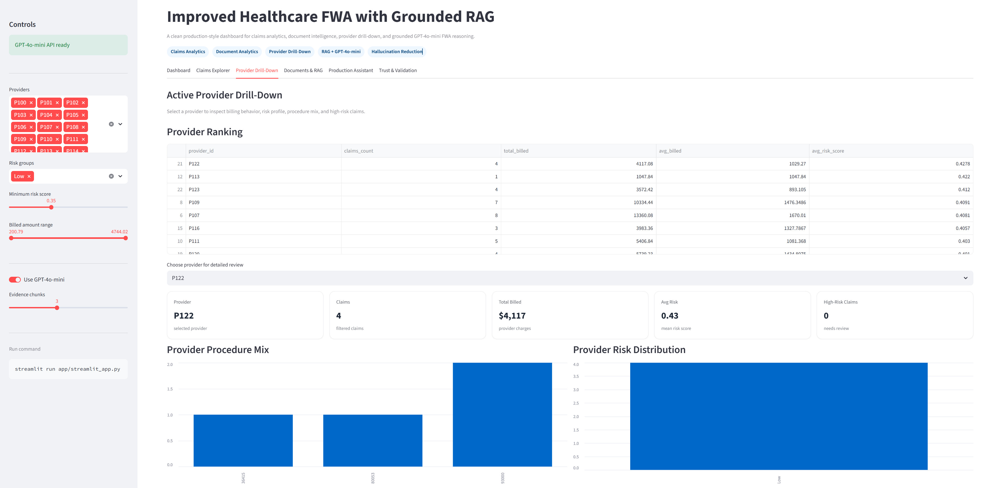
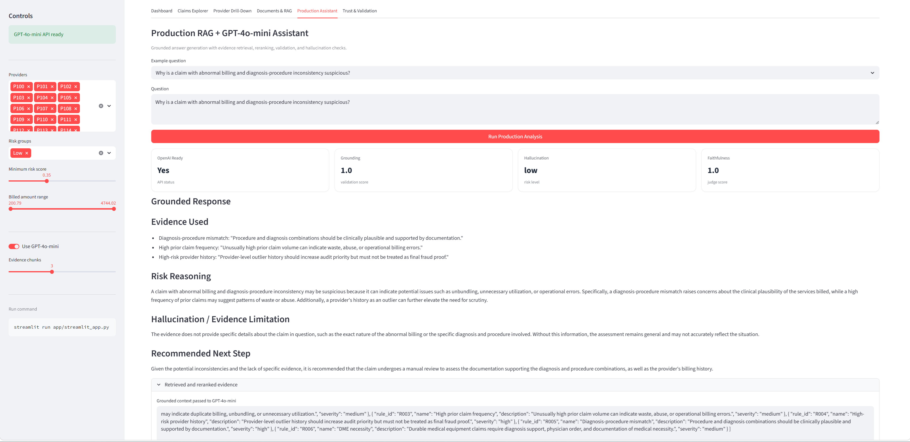
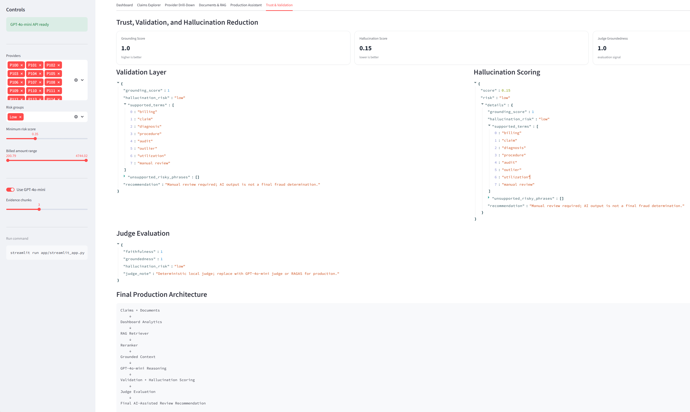

# Improved Healthcare Claims with Grounded RAG (Deployment)

## 1. Project Purpose

This project demonstrates how to build an AI-assisted healthcare FWA review-prioritization platform using:

- claims analytics
- document analytics
- grounded RAG retrieval
- reranking
- GPT-4o-mini reasoning
- validation
- hallucination reduction
- LLM-as-judge evaluation
- production-style Streamlit UI
- CI/CD Pipeline: GitHub Actions

Important: this project is for educational and analytics demonstration only. It is not a medical diagnosis tool, not a claims denial engine, and not a final fraud determination system.

---

## CI/CD Pipeline: GitHub Actions + AWS

This project also includes a real CI/CD implementation for GitHub Actions and AWS deployment.

### Added CI/CD files

```text
.github/workflows/ci-cd.yml
Dockerfile
.dockerignore
scripts/check_imports.py
scripts/validate_data.py
tests/test_ci_smoke.py
tests/test_streamlit_file.py
deployment/aws/apprunner.yaml
deployment/aws/ecs-task-definition.json
deployment/aws/README_AWS_DEPLOYMENT.md
```

### GitHub Actions workflow

The workflow performs:

1. Python dependency installation
2. import smoke tests
3. data validation
4. Streamlit syntax compilation
5. unit tests with pytest
6. Docker image build
7. Amazon ECR image push for main/master branch

### Required GitHub secrets for AWS

Add these repository secrets:

```text
AWS_ROLE_TO_ASSUME
AWS_ACCOUNT_ID
```

### OpenAI API key

Do not commit API keys.

Use:

```text
OPENAI_API_KEY
```

as:

- local environment variable
- GitHub secret
- AWS Secrets Manager secret
- App Runner/ECS runtime secret

### Local CI commands

```bash
python scripts/check_imports.py
python scripts/validate_data.py
pytest -q
python -m py_compile app/streamlit_app.py
```

### Docker local run

```bash
docker build -t healthcare-fwa-grounded-rag .
docker run -p 8501:8501 healthcare-fwa-grounded-rag
```

With GPT-4o-mini:

```bash
docker run -p 8501:8501 -e OPENAI_API_KEY=your_key healthcare-fwa-grounded-rag
```

### CI/CD Deployment Workflow Results







---

## 2. Executive Dashboard (Some Outputs)



---

## Provider Drill-Down



---

## Production RAG Assistant



---

## Validation & Hallucination Reduction



---

## 3. Final Integrated Workflow

```text
Claims + Clinical Notes + CMS Policy + Audit Rules
   ↓
Document / Claims Analytics
   ↓
RAG Retriever
   ↓
Reranker
   ↓
Grounded CMS/Audit Context
   ↓
GPT-4o-mini Reasoning
   ↓
Validation Layer
   ↓
Hallucination Scoring
   ↓
LLM-as-Judge Evaluation
   ↓
Final Grounded Response
```

---

## 4. Streamlit App

Main app:

```text
app/streamlit_app.py
```

The merged Streamlit UI includes:

1. Overview
2. Claims Analytics
3. Document Analytics
4. Production RAG + GPT-4o-mini
5. Validation & Hallucination
6. Architecture & README Notes

---

## 5. GPT-4o-mini Integration

Main file:

```text
src/llm/gpt4omini_engine.py
```

This file contains the production-style GPT-4o-mini API call:

```python
model="gpt-4o-mini"
```

GPT-4o-mini is used for grounded reasoning after the project retrieves CMS/audit context.

---

## 6. Production Orchestration

Main workflow file:

```text
src/enterprise/production_workflow.py
```

It coordinates:

- retrieval
- reranking
- GPT-4o-mini reasoning
- validation
- hallucination scoring
- judge evaluation

---

## 7. Hallucination Reduction

The project reduces hallucination using:

- evidence-only prompting
- grounded RAG context
- reranking
- low-temperature GPT-4o-mini generation
- validation checks
- hallucination scoring
- judge evaluation
- abstain/manual-review logic

---

## 8. Why This Is Production-Ready

This project is stronger than a simple chatbot because it includes:

- modular architecture
- explainable workflow
- auditable reasoning
- clear evidence display
- validation and evaluation layers
- API readiness indicator
- safe fallback behavior
- CI/CD-friendly structure

---

## 9. Run the Project

### Create environment

```bash
python -m venv fwa-env
```

### Activate on Windows

```bash
.\fwa-env\Scripts\activate
```

### Install dependencies

```bash
pip install -r requirements.txt
```

### Optional: set OpenAI API key

PowerShell:

```powershell
$env:OPENAI_API_KEY="your_openai_api_key"
```

Mac/Linux:

```bash
export OPENAI_API_KEY="your_openai_api_key"
```

### Run Streamlit

```bash
streamlit run app/streamlit_app.py
```

Open:

```text
http://localhost:8501
```

---


## 11. Summary

Built an enterprise-style healthcare FWA analytics platform using grounded RAG, GPT-4o-mini reasoning, claims/document analytics, hallucination reduction, validation checks, and LLM-as-judge evaluation to support explainable AI-assisted fraud review prioritization.


