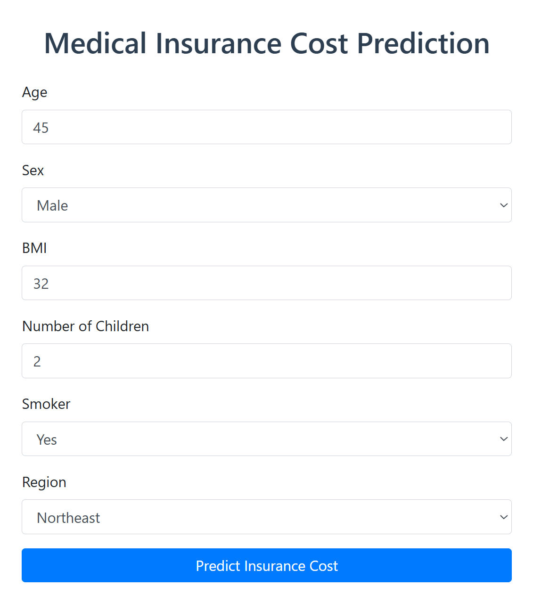

## Insurance Cost Prediction – ML Pipeline, CI/CD, and Deployment

This project uses a Random Forest model trained on the Kaggle insurance dataset to predict medical insurance charges.
It supports CI/CD with GitHub Actions and can be containerized via Docker.

### Features Implemented
- **End-to-end scikit-learn pipeline with preprocessing and model training
- **HTML form-based interface (Flask)
- **RESTful API interface (FastAPI)
- **Web routing and data processing via Flask templates
- **Unit testing using pytest
- **MLflow integration for experiment tracking
- **Dockerized application for deployment
- **GitHub Actions workflow for CI/CD automation

### Project Structure

### Environment Setup
conda create -n mlflow-venv python=3.10
conda activate mlflow-venv
pip install -r requirements.txt

### Training the Model
python prediction_model/training_pipeline.py

### Running the App Locally
uvicorn main:app --reload --port 8000

Access the application:

- **Web form interface: http://localhost:8000
- **FastAPI health check: http://localhost:8000/health
- **API POST endpoint: http://localhost:8000/fastapi/predict

### Web Input Fields (HTML Form)

### Unit Testing
pytest

### MLflow Experiment Tracking (Optional)
Start the MLflow tracking UI:
mlflow ui
Available at: http://localhost:5000

Example MLflow usage:
mlflow.set_experiment("insurance_prediction")
with mlflow.start_run():
    mlflow.log_param("model", "RandomForest")
    mlflow.log_metric("MAE", mae)
    mlflow.sklearn.log_model(model, "model")

### Docker Deployment
docker build -t insurance-api .
docker run -p 8000:8000 insurance-api
Then visit: http://localhost:8000

### GitHub Actions CI/CD
Workflow file: .github/workflows/docker-ci.yml

This workflow:
- **Installs dependencies
- **Runs training pipeline
- **Executes unit tests with pytest
- **Builds and runs Docker image
- **Confirms health check endpoint is live

### Example JSON Payload for FastAPI
{
  "age": 30,
  "sex": "female",
  "bmi": 27.5,
  "children": 1,
  "smoker": "no",
  "region": "southeast"
}

